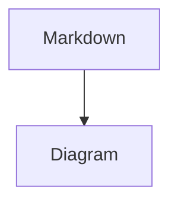
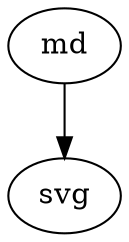

# Notes with diagrams

A Mermaid block:


```mermaid
graph TD
  A[Markdown] --> B[Diagram]
```

A Graphviz block:


```dot
digraph { md -> svg }
```

A broken block keeps its code:

```mermaid
graph TD
  A -->
```

Plain code stays code:

```ruby
puts "hello"
```
